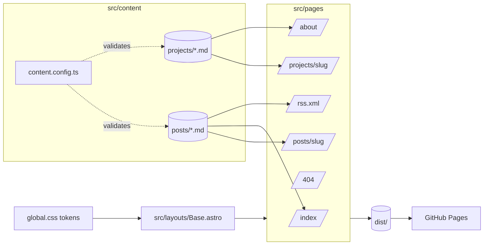

# Architecture map — SvetlinGalovBlog

A **map**, not a description. It positions the moving parts and links to where each is explained. If a sentence here could go stale without this file being touched, it belongs in `.claude/doctrine/project-profile.md` instead.

Seeded 2026-09-18 at skills adoption; flipped from target shape to current shape at PRD #21 (2026-09-18). This is the live stack — the React SPA + .NET shell it replaced is deleted, not archived here.

## Stack

Astro (static output) · Markdown content collections · plain CSS with custom-property tokens · GitHub Actions → GitHub Pages. No backend, no database, no client JS by default. Why: [ADR-002](adr/002-static-site-platform.md) — supersedes ADR-001 Decisions 2 and 4.

## Shape

## Routes

| Route | Page | Reads | Notes |
| --- | --- | --- | --- |
| `/` | Home | Posts (published) | Blog-first; post list with a short intro and an About teaser. |
| `/posts/:slug/` | Post | one Post | Table of contents from build-time headings. |
| `/about/` | About | Projects | Career arc, the three job case studies, the featured case study, contact links. Folds in the old Projects index and Contact page. |
| `/projects/:slug/` | Project | one Project | Covers all four Projects (`dowjones`, `softuni`, `vsg`, `this-site-agent-augmented`). Job layout for the three career case studies; case-study layout (eyebrow + tag row) for the featured one. |
| `/404` | Not found | — | Two links: Home, About. |
| `/rss.xml` | Feed | Posts (published) | Generated by `@astrojs/rss`. |
| `/sitemap-index.xml` | Sitemap | all routes | Generated by `@astrojs/sitemap`. |

## Collections

| Collection | Path | Schema owner | Governing constraint |
| --- | --- | --- | --- |
| Posts | `src/content/posts/` | `src/content.config.ts` | profile → Content |
| Projects | `src/content/projects/` | `src/content.config.ts` | profile → Content |

## Data lifecycle

Markdown file → (build) schema validation → static HTML in `dist/` → (push to `main`) GitHub Pages. No runtime step exists after the build.

## Where to look next

- Terms: `docs/UBIQUITOUS_LANGUAGE.md`
- Decisions: `docs/adr/` (index in `docs/adr/README.md`)
- Constraints and scars: `.claude/doctrine/project-profile.md`
- Which skill to use: `/ask-svet`
