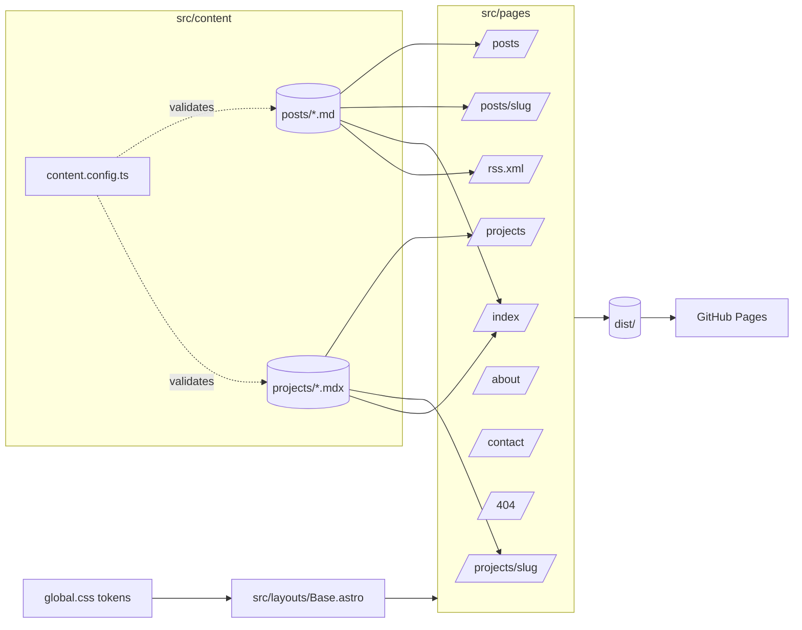

# Architecture map — SvetlinGalovBlog

A **map**, not a description. It positions the moving parts and links to where each is explained. If a sentence here could go stale without this file being touched, it belongs in `.claude/doctrine/project-profile.md` instead.

Seeded 2026-09-18 at skills adoption. Status: **target shape** — `main` still holds the retired React SPA + .NET shell until the revamp PRD merges (profile → Transition).

## Stack

Astro (static output) · Markdown/MDX content collections · plain CSS with custom-property tokens · GitHub Actions → GitHub Pages. No backend, no database, no client JS by default. Why: the revamp ADR (to be written as ADR-002; supersedes ADR-001 Decisions 2 and 4).

## Shape

## Routes

| Route | Page | Reads | Notes |
| --- | --- | --- | --- |
| `/` | Home | Posts (latest), Projects (featured) | Portfolio-first; the brief's 5-minute hiring-manager scan. |
| `/posts/` | Posts index | Posts | Drafts excluded. |
| `/posts/:slug/` | Post | one Post | |
| `/projects/` | Projects index | Projects | |
| `/projects/:slug/` | Project | one Project | |
| `/about/` | About | — | Career arc + contact links. |
| `/contact/` | Contact | — | Links only. |
| `/404` | Not found | — | Two links: Home, Projects. |
| `/rss.xml` | Feed | Posts | Generated. |

## Collections

| Collection | Path | Schema owner | Governing constraint |
| --- | --- | --- | --- |
| Posts | `src/content/posts/` | `src/content.config.ts` | profile → Content |
| Projects | `src/content/projects/` | `src/content.config.ts` | profile → Content |

## Data lifecycle

Markdown file → (build) schema validation → static HTML in `dist/` → (push to `main`) GitHub Pages. No runtime step exists after the build.

## Where to look next

- Terms: `docs/UBIQUITOUS_LANGUAGE.md`
- Decisions: `docs/adr/` (index in `docs/adr/README.md`)
- Constraints and scars: `.claude/doctrine/project-profile.md`
- Which skill to use: `/ask-svet`
